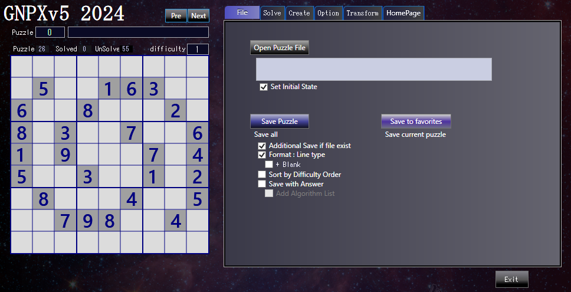

# Sudoku_Solver_Generator_v5.0 beta
 Has been uploaded (20240419). 

# Code distribution restart. The GNPXv5 project has been compressed.

# GNPX v5 HP:
  en : https://gidoo-code.github.io/Sudoku_Solver_Generator_v5/ 
  jp : https://gidoo-code.github.io/Sudoku_Solver_Generator_v5_jp/ 
  

# Sudoku_Solver_Generator
 

## 1. GNPX v5 brings significant improvements to the program. 
   GNPX v5 is a development and deployment version of new algorithms. Smartness is secondary. 
   There is no continuity with the traditional code in the analysis algorithm part of GNPX. 

## 2. The Sudoku analysis algorithm was studied. 
   i will explain using an image diagram to explain the logic.(Too specific, it will be difficult to understand the essence)t 
  (1) "Locked" in Sudoku analysis 
  (2) Extension of ALS (AnLS), extension of algorithm 
  (3) Link、network expansion 
  (4) Fish family 
  (5) SueDeCoq family, SueDeCoq's new algorithm( SueDeCoqEx, Franken SueDeCoq, Finned SueDeCoq ) 
  (6) DeathBlossom algorithm consideration 

## 3. GNPX v5 プログラム 
  (1) Improved many analysis algorithms 
  (2) Bit representation (change Bit81 to UInt128) 
